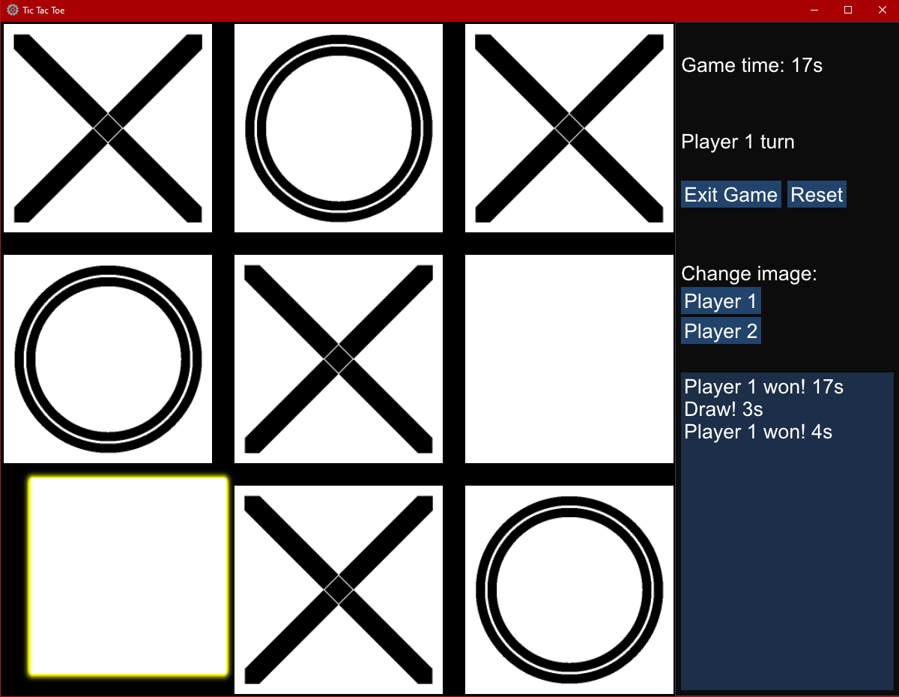
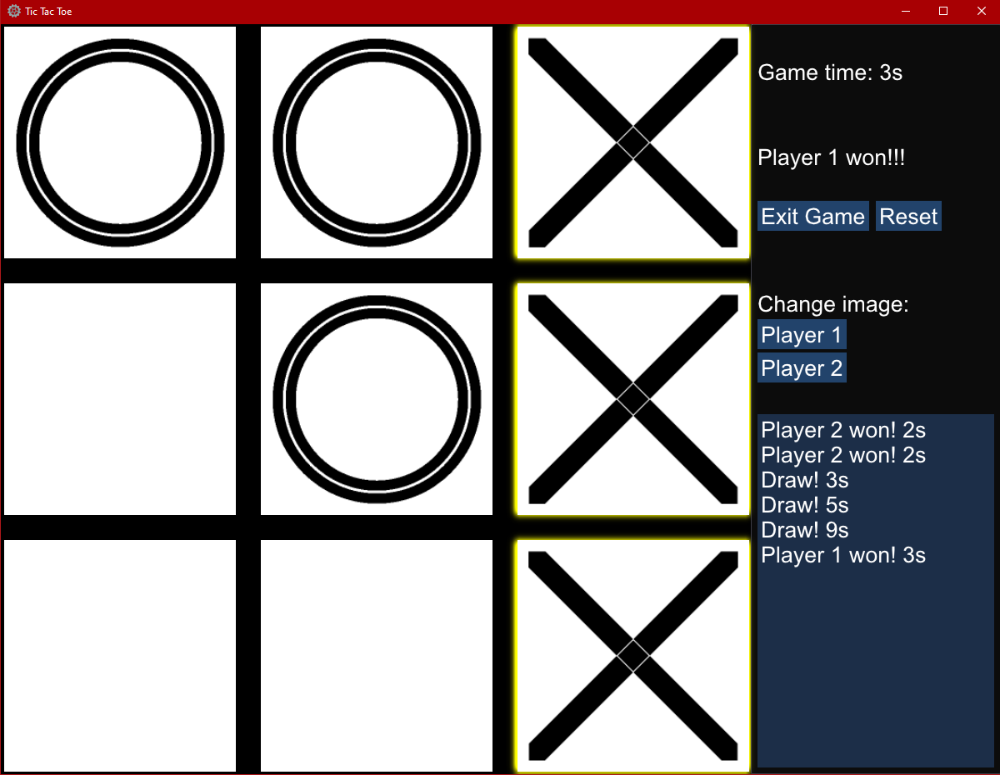

# Tic Tac Toe

Game based on subset of [Horus Engine v0.1](https://github.com/medranSolus/HorusEngine)

**IDE:** Visual Studio 2019

**Code style and formatting:** Provided by VS extension [CodeMaid](http://www.codemaid.net/)

**External libraries:**
  - [Dear ImGui 1.78](https://github.com/ocornut/imgui)

## Screens

### Main game

### Player wins

